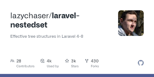
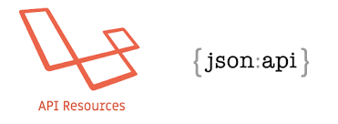

# Desarrollo de API

🔨 Instrucciones para su funcionamiento
Requiere Copiar o Clonar el repositorio.

**Lista de comandos**

    git clone gh repo clone Guerrero85/Graph-API_Laravel
    cd Graph-API_Laravel
    composer install
    cp .env.example .env
    
**Asegúrese de establecer la información de conexión de la base de datos correcta antes de ejecutar las migraciones** [Variables de entorno](#variables-de-entorno)

    php artisan migrate 
    php artisan serve

Ahora puede acceder al servidor en http://localhost:8000

## Database seeding

**Rellene la base de datos con datos iniciales con relaciones que contienen Nodos padres e hijos. Esto puede ayudarlo a comenzar a probar rápidamente la API o acoplar una interfaz y comenzar a usarla con contenido listo.**

Abra Databases y establezca los valores de propiedad según sus requisitos

    database/seeds/NodoDataSeeder.php

Ejecute el seeder de base de datos y listo.

    php artisan db:seed

***Nota***: Se recomienda tener una base de datos limpia antes de usar Seeders. Puede actualizar sus migraciones en cualquier momento para limpiar la base de datos ejecutando el siguiente comando

    php artisan migrate:refresh
    
Se puede acceder a la API en [http://localhost:8000/api/nodo](http://127.0.0.1:8000/api/nodo).

## Especificación API

Esta aplicación se adhiere a las especificaciones de API establecidas por el equipo de [Thinkster](https://github.com/gothinkster). Esto ayuda a mezclar y combinar cualquier backend con cualquier otro frontend sin conflictos.

> [Full API Spec](https://github.com/gothinkster/realworld/tree/master/api)

More information regarding the project can be found here https://github.com/gothinkster/realworld

----------

# Code overview

## Dependencies

- [jwt-auth](https://github.com/tymondesigns/jwt-auth) - For authentication using JSON Web Tokens
- [laravel-cors](https://github.com/barryvdh/laravel-cors) - For handling Cross-Origin Resource Sharing (CORS)

## Folders

- `app` - Contains all the Eloquent models
- `app/Http/Controllers/Api` - Contains all the api controllers
- `app/Http/Middleware` - Contains the JWT auth middleware
- `app/Http/Requests/Api` - Contains all the api form requests
- `app/RealWorld/Favorite` - Contains the files implementing the favorite feature
- `app/RealWorld/Filters` - Contains the query filters used for filtering api requests
- `app/RealWorld/Follow` - Contains the files implementing the follow feature
- `app/RealWorld/Paginate` - Contains the pagination class used to paginate the result
- `app/RealWorld/Slug` - Contains the files implementing slugs to articles
- `app/RealWorld/Transformers` - Contains all the data transformers
- `config` - Contains all the application configuration files
- `database/factories` - Contains the model factory for all the models
- `database/migrations` - Contains all the database migrations
- `database/seeds` - Contains the database seeder
- `routes` - Contains all the api routes defined in api.php file
- `tests` - Contains all the application tests
- `tests/Feature/Api` - Contains all the api tests

Command to run: dotnet run (inside terminal).

|Package|Documentation|Group Chat|
|:-----:|:-----------:|:--------:|
|  |  |  |
